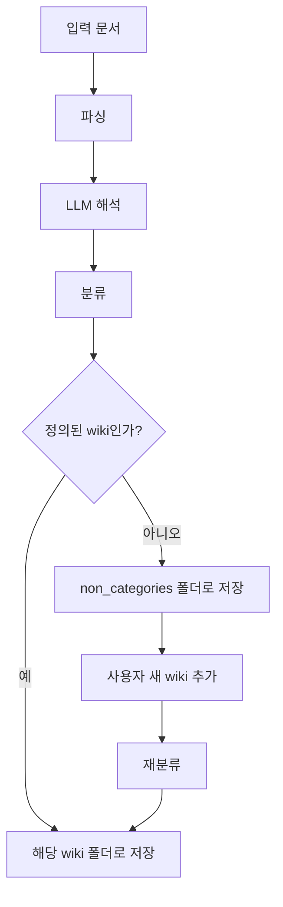

1. docker compose 운영 지원, 

2. obsidian wiki 방식 변경

| 변경 영역 | 지금 | 바뀌는 방향 |
|---|---|---|
| 분류 | 사실상 entity/concept/source 중심의 고정 분기 | 정의된 wiki / 미정의(non_categories) 1차 분기 추가 |
| 저장 위치 | sources, entities, concepts, synthesis | non_categories 추가 + 나중에 재분류 가능 |
| 메타데이터 | source 기반 중심 | category, status, confidence, promoted_from 같은 상태 필요 |
| 사용자 반영 | ingest 시점에 바로 반영 | 사용자가 새 wiki를 추가하면 non_categories를 다시 재분류 |
| 갱신 작업 | index/log 갱신 | 이동(move)과 재링크(rebuild)가 추가됨 |

3. 대시보드에서의 역할 추가
  1) LLM 서버 설정 (.env 기반) : 서버주소, api key, 모델
  2) LLM Promft 설정 : 기본 프로프트를 웹서버에서 바로 편집 
  3) LLM json 파싱 후 wiki 처리 결과 로깅 : 결과에 따른 프롬프트 개선 작업시 필요
  4) claude, codex, gemini와 연결가능한 mcp protocol 설정
  5) wiki 목록 확인 및 편집기능

