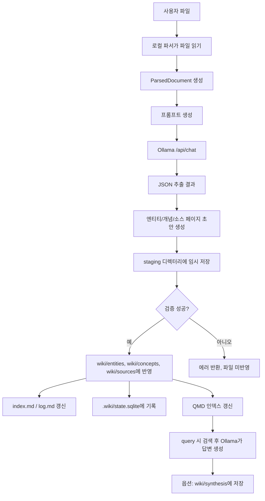

할 일 목록 업데이트됨

아래처럼 정리하면 됩니다. 핵심은 Ollama가 파일을 직접 열지 않고, 로컬 코드가 파일을 읽어 텍스트로 넘긴 뒤, Ollama는 그 텍스트만 처리한다는 점입니다.

| 단계 | 누가 처리하나 | 입력 | 실제 동작 | 결과 파일/상태 |
|---|---|---|---|---|
| 1. 파일 추가 | 로컬 코드 | 사용자가 지정한 파일/폴더 | ingest_raw.add_file 이 파일을 raw로 복사하고, 파서로 읽어 텍스트/해시를 만듦 | raw/에 원본 보관, DB에 sources 등록 |
| 2. 텍스트 정규화 | 로컬 파서 | raw 안의 실제 파일 | base.py가 파일을 plain text로 정규화하고 해시 생성 | LLM이 받을 입력 텍스트 준비 |
| 3. 추출 요청 | Ollama | 파서가 만든 텍스트 + 프롬프트 | prompts.py가 프롬프트를 만들고 OllamaClient.chat으로 JSON 추출 요청 | 엔티티, 개념, 요약 JSON 반환 |
| 4. 페이지 작성 | Ollama + 로컬 코드 | 추출 결과, source 텍스트 일부, 관련 링크 | ingest_llm.py 가 entity/concept/source 페이지 초안을 만들게 요청 | staging 파일 생성 |
| 5. 최종 반영 | 로컬 코드 | staging에 생성된 markdown | 검증 후 shutil.copy2 로 wiki/entities, wiki/concepts, wiki/sources에 저장 | wiki/에 실제 페이지 생성/갱신 |
| 6. 인덱스/로그 갱신 | 로컬 코드 | 현재 wiki 디렉터리 | page_writer.write_page 및 index/log 재생성 | index.md, log.md 업데이트 |
| 7. 검색용 색인 | 로컬 검색 백엔드 | wiki/raw 파일들 | QMD가 로컬에서 인덱싱 | .wiki/qmd.sqlite 등 검색 상태 갱신 |
| 8. 질의 | 로컬 코드 + Ollama | 검색된 wiki 페이지 내용 | query.py 가 검색 결과를 모아 Ollama에 답변 생성을 요청 | 답변 문자열, 필요하면 synthesis 페이지 저장 |
| 9. 저장형 질의 | 로컬 코드 | 답변 + 참고한 페이지들 | 저장을 선택하면 wiki/synthesis에 새 페이지 작성 | synthesis/<slug>.md 생성 |
| 10. lint 자동 수정 | 로컬 코드 | 위키 페이지 전체 | lint.py 가 마크다운 파일을 직접 수정 | broken link, frontmatter 등 수정 |

순서도로 보면 이렇게 이해하면 가장 정확합니다.

한 줄로 압축하면, 흐름은 “파일은 로컬이 읽고, Ollama는 텍스트만 처리하고, 결과 파일 저장도 로컬이 한다”입니다.

원하시면 다음 답변에서 이걸 더 좁혀서 add / ingest / query / lint 별로 실제 생성되는 파일 목록만 따로 뽑아드릴게요.

CLI가 프롬프트를 직접 만드는지, 아니면 prompts.py의 템플릿을 조합해서 넘기는지 경로를 좁히겠습니다. 이어서 cli.py의 ingest 진입점과 prompts.py의 템플릿 구성을 확인하겠습니다.

맞습니다. 이 구조에서 CLI는 Ollama가 만든 JSON을 직접 “생성”하는 쪽이 아니라, 프롬프트를 담아 Ollama에 보내고 돌아온 결과를 검증·저장하는 오케스트레이터입니다. JSON 스키마와 프롬프트 본문은 CLI가 아니라 prompts.py 쪽에 모여 있고, 실제 ingest 흐름은 cli.py:620 → ingest_llm.py:329 순서로 내려갑니다.

구간	역할	위치
CLI	Ollama 준비 확인, ingest/query 명령 전달	cli.py:620, cli.py:840
프롬프트 정의	JSON 추출용 문구, 페이지 작성용 템플릿, 머지 템플릿	prompts.py:1, prompts.py:100
LLM 호출	프롬프트를 ChatMessage 목록으로 바꿔 Ollama에 전송	llm.py:44, llm.py:117
JSON 검증	Ollama 응답을 JSON으로 파싱하고 실패 시 재시도	ingest_llm.py:329
파일 저장	staging에 쓰고 성공하면 wiki/에 반영	ingest_llm.py:745
프롬프트는 이렇게 구성돼 있습니다. 먼저 prompts.py 상단의 SYSTEM_PROMPT가 공통 규칙을 정의하고, Pass 1의 EXTRACTION_INSTRUCTIONS가 “반드시 JSON만 반환”하도록 스키마를 강제합니다. 그걸 prompts.py:100가 system/user 메시지 2개로 묶어서 Ollama에 넘깁니다. JSON이 깨지면 build_extraction_retry_messages로 한 번 더 재요청합니다.

흐름을 순서도로 보면 이렇습니다.

핵심만 더 압축하면 이렇습니다. CLI는 “어떤 작업을 할지”만 결정하고, 프롬프트 내용은 prompts.py에, JSON 검증은 ingest_llm.py:329 쪽에, 실제 LLM 호출은 llm.py:117과 llm.py:166에 있습니다.